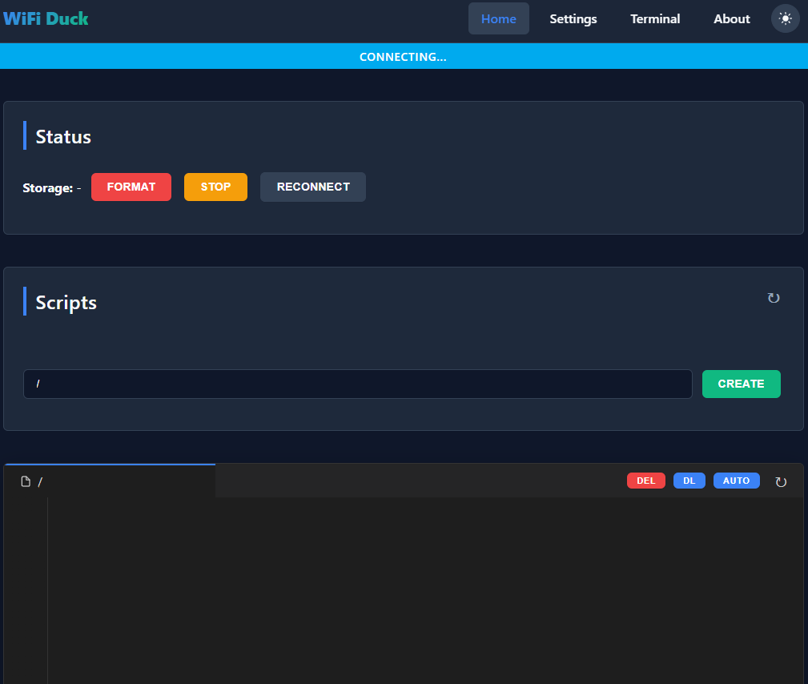
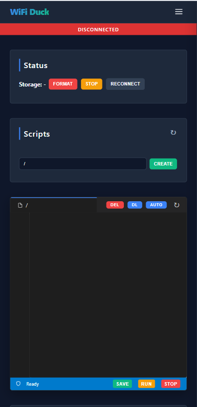
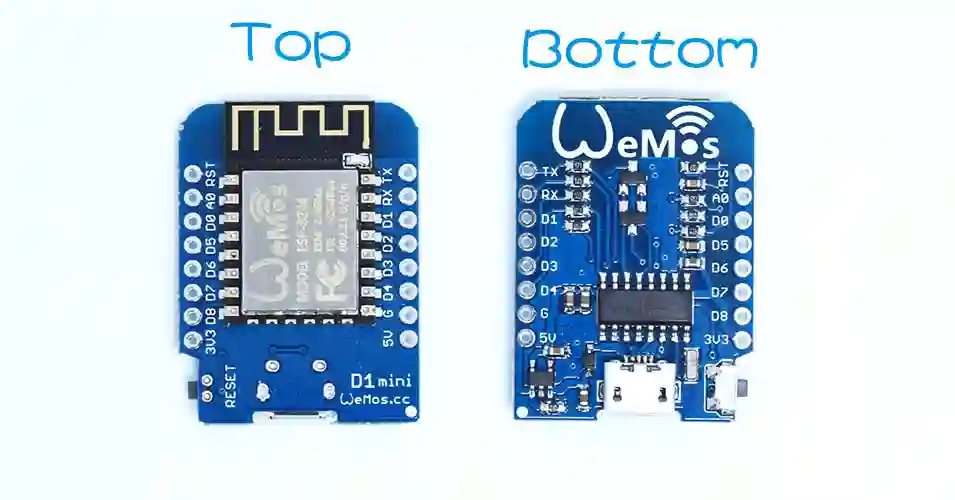
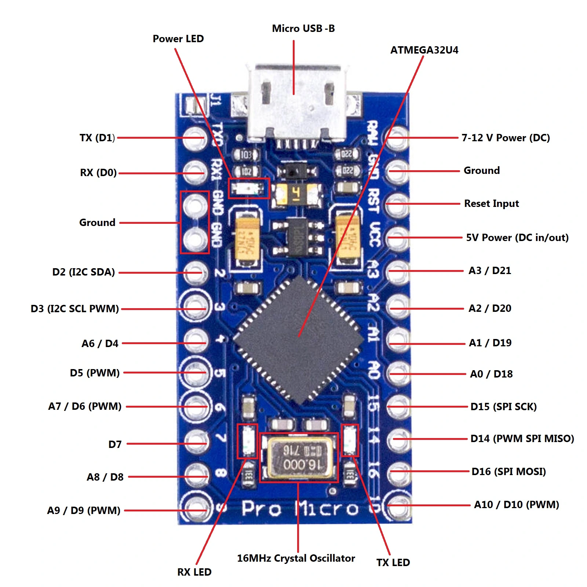
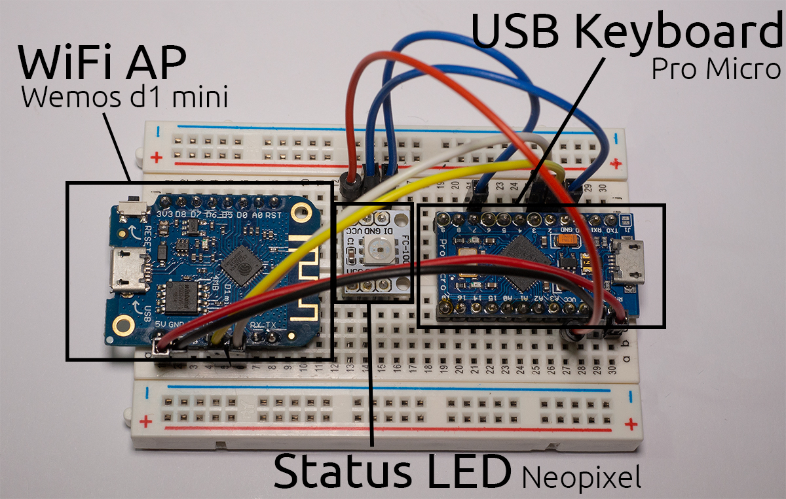

# Antarmuka Web WiFi Duck

Antarmuka web modern dan responsif untuk proyek WiFi Duck, dirancang agar Anda dapat mengelola dan menjalankan *script payload* (Ducky Script) dengan mudah langsung dari *browser* Anda.

## Pratinjau

### Tampilan Desktop

### Tampilan Mobile

## Fitur Utama

Antarmuka ini menyediakan fitur lengkap untuk mengendalikan perangkat WiFi Duck Anda.

| Fitur | Deskripsi |
|---|---|
| **Script Editor** | Editor kode bawaan untuk membuat, mengedit, dan menyimpan Ducky Script langsung ke dalam memori perangkat. |
| **Live Terminal** | Terminal interaktif bergaya *hacker* untuk menjalankan perintah secara langsung, melihat log keluaran, dan memantau status alat. |
| **Responsive UI** | Tampilan antarmuka yang sangat fleksibel, memastikan tata letak tetap rapi dan nyaman digunakan baik di layar komputer maupun HP. |
| **Theme Toggle** | Tombol praktis untuk berganti antara mode Terang (Light) dan Gelap (Dark) sesuai selera mata Anda. |
| **Live Status** | Indikator koneksi *real-time* dan pemantau sisa memori penyimpanan langsung dari halaman utama. |
| **Custom Modals** | Dialog *popup* khusus yang super cepat, ringan, elegan, dan tidak memblokir pergerakan *browser*. |
| **Settings Management** | Ubah nama WiFi (SSID), *password*, dan saluran (Channel) langsung dari *browser* tanpa perlu melakukan *flash* ulang alatnya. |

## Hardware yang Digunakan

Proyek ini menggunakan dua modul mikrokontroler yang saling terhubung:

| Wemos D1 Mini | Arduino Pro Micro |
|:---:|:---:|
|  |  |
| Menangani WiFi & Web Server | Menangani USB Keyboard (HID) |

### Struktur Perangkaian (*Wiring*)

Berikut adalah foto implementasi nyata WiFi Duck pada *breadboard*. Kedua modul dihubungkan melalui kabel jumper untuk komunikasi serial, ditambah satu modul **Neopixel LED** sebagai indikator status.

| Komponen | Fungsi |
|---|---|
| **Wemos D1 Mini** (kiri) | WiFi Access Point — memancarkan sinyal WiFi dan menjalankan Web Server. |
| **Arduino Pro Micro** (kanan) | USB Keyboard (HID) — dicolokkan ke komputer target untuk mengeksekusi *payload*. |
| **Neopixel LED** (tengah) | Status LED — menampilkan warna berbeda sesuai kondisi alat (siap/menjalankan *script*/error). |
| **Breadboard** | Media perangkaian tanpa solder untuk menghubungkan seluruh komponen. |

## Analisis & Ringkasan Proyek

Berdasarkan arsitektur internal repositori ini, WiFi Duck bekerja menggunakan sistem dua mikrokontroler (*dual-MCU*):
1. **Wemos D1 Mini (ESP8266)** (berada di *folder* `esp_duck`): Bertugas menangani server web, memancarkan sinyal WiFi (Access Point), dan menyimpan file *script* (SPIFFS).
2. **Arduino Pro Micro (ATmega32u4)** (berada di *folder* `atmega_duck`): Berperan sebagai *keyboard* USB (HID) yang bertugas mengeksekusi *script/payload* yang dikirimkan oleh Wemos D1 Mini melalui komunikasi serial/I2C.

Proyek ini sekarang berada di **Versi 1.2.0** dan secara bawaan menggunakan alamat `wifi.duck` agar mudah diakses di *browser*.

## Panduan Cepat

### 1. Menghubungkan ke Perangkat
Nyalakan WiFi Duck Anda. Alat ini akan memancarkan sinyal WiFi-nya sendiri. Hubungkan komputer atau HP Anda ke jaringan WiFi tersebut. Secara bawaan (default), nama WiFi-nya adalah `wifiduck` dengan kata sandi `wifiduck`.

### 2. Mengakses Antarmuka (Web UI)
Buka *browser* web favorit Anda lalu ketikkan alamat `http://192.168.4.1` atau `wifi.duck`. Anda akan disambut oleh halaman *dashboard* utama tempat Anda bisa melihat memori perangkat dan daftar *script*.

### 3. Mengelola Script
- **Membuat**: Ketik nama file baru di kolom yang tersedia lalu klik **Create**.
- **Mengedit**: Klik salah satu *script* yang sudah ada untuk memuat isinya ke dalam teks editor.
- **Menjalankan**: Tekan tombol **Run** untuk langsung mengeksekusi *script* tersebut pada komputer korban.
- **Menghapus**: Gunakan tombol **Delete** untuk membuang *script* yang tidak diperlukan lagi.

### 4. Akses Terminal
Buka halaman **Terminal** melalui menu navigasi di atas untuk masuk ke mode *command line* secara langsung. Ini memungkinkan Anda untuk berinteraksi dengan alat lebih jauh, seperti memformat penyimpanan (SPIFFS), mengecek variabel sistem, atau menjalankan perintah *ducky* baris demi baris secara manual.

## Referensi Ducky Script

Berikut adalah panduan cepat untuk beberapa perintah umum yang bisa Anda ketik di editor.

| Perintah | Contoh Penggunaan | Penjelasan |
|---|---|---|
| `STRING` | `STRING Halo Dunia` | Mengetikkan teks persis seperti yang tertulis. |
| `ENTER` | `ENTER` | Mensimulasikan penekanan tombol Enter/Return. |
| `DELAY` | `DELAY 1000` | Menjeda eksekusi selama waktu yang ditentukan dalam milidetik (contoh: 1000 = 1 detik). |
| `GUI` / `WINDOWS` | `GUI r` | Menekan tombol Windows bersamaan dengan tombol lain (contoh: membuka dialog Run). |
| `ALT` / `CTRL` / `SHIFT` | `CTRL c` | Digunakan untuk menjalankan kombinasi *shortcut* keyboard. |
| `JITTER` | `JITTER ON` / `JITTER OFF` | Mengaktifkan/menonaktifkan mode pengetikan siluman (jeda acak 15-45ms per huruf) agar lolos deteksi *Antivirus/Heuristics*. |

## Catatan Keamanan

Antarmuka ini dilengkapi dengan fitur perlindungan pemulihan otomatis (*self-healing*) untuk mencegah perubahan yang tidak disengaja maupun modifikasi nakal pada hak cipta *footer* melalui *developer tools* di *browser*. Pastikan Anda membiarkan *script* tersebut utuh agar aplikasi dapat berjalan dengan lancar.

## Kredit

Dikembangkan dan didesain ulang oleh [denoyey](https://github.com/denoyey).