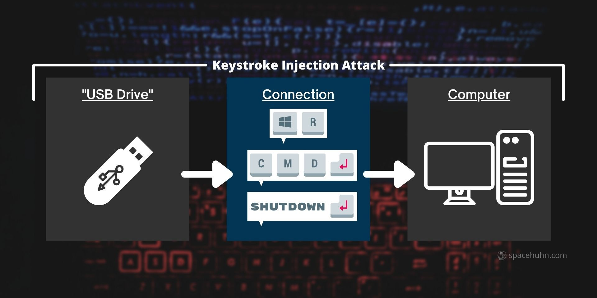

<p align="center">
  
</p>

<h1 align="center">🦆 WiFi Duck</h1>

<p align="center">
  <strong>Keystroke Injection Attack Platform — Dikendalikan via WiFi</strong>
</p>

<p align="center">
  
  
  
  
</p>

<p align="center">
  <em>Antarmuka web modern dan responsif untuk proyek WiFi Duck, dirancang agar Anda dapat mengelola dan menjalankan script payload (Ducky Script) dengan mudah langsung dari browser Anda.</em>
</p>

---

## 📸 Pratinjau

<table>
  <tr>
    <th>🖥️ Tampilan Desktop</th>
    <th>📱 Tampilan Mobile</th>
  </tr>
  <tr>
    <td></td>
    <td></td>
  </tr>
</table>

---

## ✨ Fitur Utama

Antarmuka ini menyediakan fitur lengkap untuk mengendalikan perangkat WiFi Duck Anda.

| Fitur | Deskripsi |
|:---|:---|
| 📝 **Script Editor** | Editor kode bawaan dengan *Syntax Highlighting* untuk membuat, mengedit, dan menyimpan Ducky Script langsung ke dalam memori perangkat. |
| 💻 **Live Terminal** | Terminal interaktif bergaya *hacker* untuk menjalankan perintah secara langsung dan memantau status alat. |
| 📱 **Responsive UI** | Tampilan antarmuka yang sangat fleksibel, nyaman digunakan baik di layar komputer maupun HP. |
| 🌗 **Theme Toggle** | Tombol praktis untuk berganti antara mode Terang dan Gelap sesuai selera mata Anda. |
| 📡 **Live Status** | Indikator koneksi *real-time* dan pemantau sisa memori penyimpanan langsung dari halaman utama. |
| 🪟 **Custom Modals** | Dialog *popup* khusus yang super cepat, ringan, dan elegan. |
| ⚙️ **Settings Management** | Ubah SSID, *password*, dan channel langsung dari *browser* tanpa perlu *flash* ulang. |
| 🥷 **Stealth Jitter** | Mode pengetikan siluman dengan jeda acak (15-45ms) untuk mengelabui deteksi Antivirus. |

---

## 🔧 Hardware yang Digunakan

Proyek ini menggunakan dua modul mikrokontroler yang saling terhubung:

<table>
  <tr>
    <th align="center">📶 Wemos D1 Mini</th>
    <th align="center">⌨️ Arduino Pro Micro</th>
  </tr>
  <tr>
    <td align="center"></td>
    <td align="center"></td>
  </tr>
  <tr>
    <td align="center"><em>Menangani WiFi & Web Server</em></td>
    <td align="center"><em>Menangani USB Keyboard (HID)</em></td>
  </tr>
</table>

### 🔌 Struktur Perangkaian (*Wiring*)

Berikut adalah foto implementasi nyata WiFi Duck pada *breadboard*. Kedua modul dihubungkan melalui kabel jumper untuk komunikasi serial, ditambah satu modul **Neopixel LED** sebagai indikator status.

<p align="center">
  
</p>

| Komponen | Fungsi |
|:---|:---|
| 📶 **Wemos D1 Mini** | WiFi Access Point — memancarkan sinyal WiFi dan menjalankan Web Server. |
| ⌨️ **Arduino Pro Micro** | USB Keyboard (HID) — dicolokkan ke komputer target untuk mengeksekusi *payload*. |
| 💡 **Neopixel LED** | Status LED — menampilkan warna berbeda sesuai kondisi alat. |
| 🧩 **Breadboard** | Media perangkaian tanpa solder untuk menghubungkan seluruh komponen. |

---

## 🦆 Cara Kerja WiFi Duck

WiFi Duck bekerja dengan prinsip ***Keystroke Injection Attack*** — alat ini menyamar sebagai *keyboard* USB biasa di mata komputer target. Begitu dicolokkan, alat akan secara otomatis mengetikkan perintah-perintah dengan kecepatan super tinggi, persis seperti ada orang tak terlihat yang sedang mengetik di komputer Anda.

<p align="center">
  
</p>

| Tahap | Proses |
|:---:|:---|
| 1️⃣ **USB Drive** | WiFi Duck dicolokkan ke port USB komputer target. Sistem operasi mengenalinya sebagai *keyboard* biasa. |
| 2️⃣ **Connection** | Alat mengirimkan rangkaian penekanan tombol otomatis, misalnya: `Win+R` → `CMD` → `Enter` → `SHUTDOWN`. |
| 3️⃣ **Computer** | Komputer target mengeksekusi semua perintah tanpa curiga, karena sumbernya dianggap berasal dari *keyboard* fisik yang sah. |

> 💡 **Yang membuat WiFi Duck istimewa:** Anda bisa mengontrol dan memodifikasi *script* serangan secara nirkabel (*wireless*) melalui antarmuka web dari HP Anda — tanpa perlu menyentuh komputer target lagi setelah alat dicolokkan!

---

## 🏗️ Arsitektur Proyek

```
WiFi Duck bekerja menggunakan sistem dual-MCU (dua mikrokontroler):

┌──────────────────────┐        Serial/I2C        ┌──────────────────────┐
│   Wemos D1 Mini      │ ◄───────────────────────► │  Arduino Pro Micro   │
│   (ESP8266)          │                           │  (ATmega32u4)        │
│                      │                           │                      │
│  📂 esp_duck/        │                           │  📂 atmega_duck/     │
│  • Web Server        │                           │  • USB HID Keyboard  │
│  • WiFi AP           │                           │  • Ducky Parser      │
│  • SPIFFS Storage    │                           │  • Keystroke Inject   │
│  • Script Manager    │                           │  • Jitter Engine      │
└──────────────────────┘                           └──────────────────────┘
```

---

## 🚀 Panduan Cepat

### 1️⃣ Menghubungkan ke Perangkat
Nyalakan WiFi Duck Anda. Alat ini akan memancarkan sinyal WiFi-nya sendiri. Hubungkan komputer atau HP Anda ke jaringan WiFi tersebut.

> **Default:** SSID = `wifiduck` · Password = `wifiduck`

### 2️⃣ Mengakses Antarmuka (Web UI)
Buka *browser* lalu ketikkan alamat:

```
http://192.168.4.1
```
atau
```
http://wifi.duck
```

### 3️⃣ Mengelola Script

| Aksi | Cara |
|:---|:---|
| ➕ **Membuat** | Ketik nama file baru di kolom yang tersedia lalu klik **Create**. |
| ✏️ **Mengedit** | Klik salah satu *script* yang sudah ada untuk memuat isinya ke dalam editor. |
| ▶️ **Menjalankan** | Tekan tombol **Run** untuk mengeksekusi *script* pada komputer target. |
| 🗑️ **Menghapus** | Gunakan tombol **Delete** untuk membuang *script* yang tidak diperlukan. |

### 4️⃣ Akses Terminal
Buka halaman **Terminal** melalui menu navigasi untuk masuk ke mode *command line* secara langsung — memformat SPIFFS, mengecek variabel sistem, atau menjalankan perintah *ducky* baris demi baris.

---

## 📖 Referensi Ducky Script

Berikut adalah panduan cepat untuk perintah yang bisa Anda ketik di editor.

| Perintah | Contoh | Penjelasan |
|:---|:---|:---|
| `STRING` | `STRING Halo Dunia` | Mengetikkan teks persis seperti yang tertulis. |
| `ENTER` | `ENTER` | Mensimulasikan penekanan tombol Enter. |
| `DELAY` | `DELAY 1000` | Menjeda eksekusi (dalam milidetik). |
| `GUI` / `WINDOWS` | `GUI r` | Menekan tombol Windows + tombol lain. |
| `ALT` / `CTRL` / `SHIFT` | `CTRL c` | Kombinasi *shortcut* keyboard. |
| `JITTER` | `JITTER ON` / `JITTER OFF` | Mode pengetikan siluman (jeda acak 15-45ms per huruf). |
| `REPEAT` | `REPEAT 3` | Mengulangi perintah terakhir sebanyak N kali. |
| `REM` | `REM ini komentar` | Komentar (tidak dieksekusi). |
| `LED` | `LED 255 0 0` | Mengatur warna Neopixel LED (R G B). |

### 💡 Contoh Script

```
REM === Contoh: Buka Notepad dan ketik pesan ===
DEFAULTDELAY 200
GUI r
DELAY 500
STRING notepad
ENTER
DELAY 1000
JITTER ON
STRING Halo! Ini dikirim oleh WiFi Duck 🦆
JITTER OFF
```

---

## 🔒 Catatan Keamanan

Antarmuka ini dilengkapi dengan fitur perlindungan pemulihan otomatis (*self-healing*) untuk mencegah perubahan yang tidak disengaja maupun modifikasi nakal pada hak cipta *footer* melalui *developer tools* di *browser*.

---

## 👨‍💻 Kredit

<p align="center">
  Dikembangkan dan didesain ulang oleh <a href="https://github.com/denoyey"><strong>denoyey</strong></a> 🦆
</p>